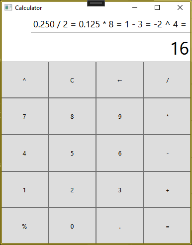

# calculator.cs

## Overview
This is a simple calculator application built using WPF (Windows Presentation Foundation) in C#. The calculator supports basic arithmetic operations such as addition, subtraction, multiplication, division, exponentiation, and modulus. Additionally, it provides functionality for clearing the display, deleting the last digit, and entering decimal points.

The user interface is designed using XAML, and the logic behind the calculator's operations is handled in C#.

### Features:
- **Basic Arithmetic Operations**: +, -, *, /
- **Advanced Operations**: %, ^ (Exponentiation)
- **Clear**: Clears the display and resets the calculator.
- **Delete**: Deletes the last entered digit.
- **Decimal Point**: Allows entering decimal values.
- **History Display**: Shows the history of operations performed.

## UI Components

- **Display**: The main area where numbers and results are shown. It can also show the history of operations performed above it.
- **History Display**: Shows a log of the most recent calculations, updating after every operation.
- **Buttons**: There are buttons for numbers, operations, and special functions (clear, delete, equals).

### Button Descriptions:
1. **Number Buttons (0-9)**

2. **Operation Buttons (+, -, *, /)**

3. **Exponentiation (^)**

4. **Modulus (%)**

5. **Clear (C)**

6. **Delete (←)**

7. **Equals (=)**

8. **Decimal Point (.)**

## Example Usage

### 0. Starting the Calculator
When the calculator is opened, the display shows `0` and the history display is empty.

  

### 1. Calculation Example 1
- Click `2` `+` `2` `+` `2` `+` `2` `+` `2` `=`.
- The result displayed will be `10`.

 

### 2. Calculation Example 2
- Enter `0.250` `/` `2` `*` `8` `-` `3` `^` `4` `=`.
- The result displayed will be `8`.

 

### 3. Calculation Example 3
- Enter `7` `%` `5` `+` `6` `*` `2` `^` `0.5` `=`.
- The result displayed will be `8`.

 

## Conclusion
This calculator offers a straightforward user interface for performing basic and advanced arithmetic operations. The design is simple, with clear buttons for each function, and the history display allows the user to track previous calculations. With this application, users can efficiently perform calculations, clear entries, or delete incorrect digits.

